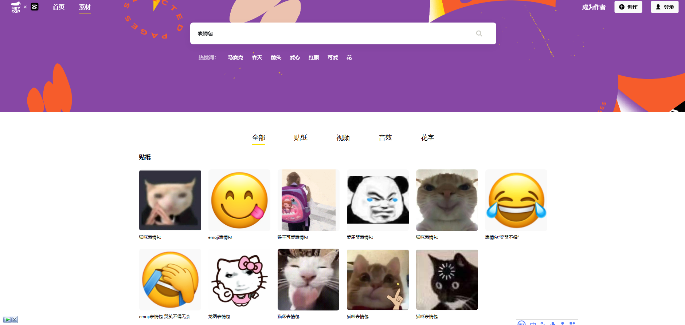
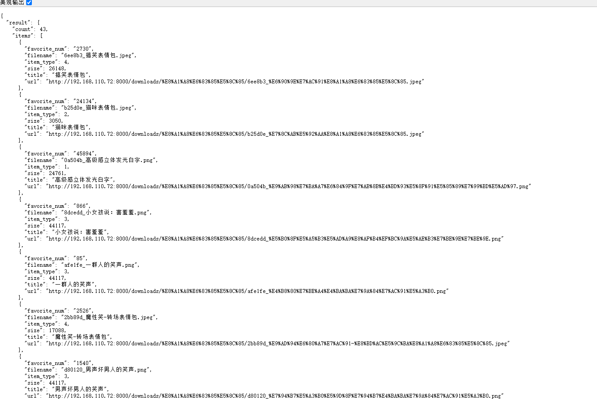
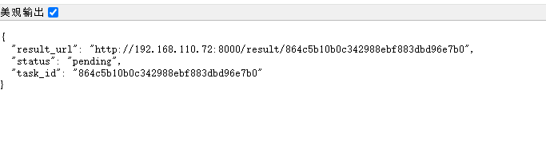

# heycan.com 表情包搜索 Web API

一个用于从 heycan.com 网站搜索并下载表情包的 Web API 服务。支持同步和异步模式，可自动清理过期文件。

## 功能特性

- **关键词搜索**：根据关键词搜索表情包/贴纸
- **多类型支持**：支持贴纸、表情、花字、视频/音效等多种素材类型
- **并发搜索**：BrowserPool 复用浏览器实例，支持并发搜索
- **异步任务**：支持异步模式，避免长时间等待
- **自动清理**：定时清理超过 24 小时的临时图片
- **风控防护**：随机 User-Agent 轮换降低被封禁风险

## 界面预览

### 1. heycan.com 搜索结果页面



### 2. 下载的表情包文件（按关键词分类）


## 快速开始

### 本地运行

```bash
# 安装依赖
pip install -r requirements.txt

# 启动服务
python app.py --host 0.0.0.0 --port 8000
```

### Linux 部署

```bash
# 安装依赖
pip install -r requirements.txt
apt install chromium chromium-driver  # 或安装 google-chrome

# 启动服务（root 用户已自动加 --no-sandbox）
python app.py --host 0.0.0.0 --port 8000

# 生产环境建议
pip install waitress
waitress-serve --listen=0.0.0.0:8000 app:app
```

## API 接口

### 1. 搜索接口

```
GET /search?q=猫&count=10&type=2
```

**参数说明：**

| 参数 | 类型 | 必填 | 说明 |
|------|------|------|------|
| q | string | 是 | 搜索关键词 |
| count | int | 否 | 每词返回张数，默认 10，最大 50 |
| type | int | 否 | 素材类型：2=贴纸/表情 (默认)，0=全部，1=花字，3=视频/音效，4=其他 |
| async | int | 否 | 异步模式：1=异步，不填或 0=同步 |

**响应示例：**

```json
{
  "keyword": "猫",
  "count": 10,
  "items": [
    {
      "title": "可爱的猫咪",
      "url": "http://localhost:8000/downloads/猫/xxx.png",
      "filename": "xxx.png",
      "size": 12345,
      "item_type": 2,
      "favorite_num": 100
    }
  ]
}
```

**异步模式响应：**

```json
{
  "task_id": "abc123...",
  "status": "pending",
  "result_url": "http://localhost:8000/result/abc123..."
}
```

**查询异步任务状态：**

```bash
GET /result/<task_id>
```

可能的状态值：`pending`, `running`, `done`, `error`

**访问下载的图片：**

```bash
GET /downloads/<相对路径>
```

**健康检查：**

```bash
GET /health
```

```json
{
  "ok": true,
  "time": "2026-09-01 10:30:00",
  "pool_size": 2
}
```

### 运行示例

#### Python 请求示例

```python
import requests

# 同步搜索
response = requests.get('http://localhost:8000/search', params={
    'q': '猫',
    'count': 10,
    'type': 2
})
print(response.json())

# 异步搜索
response = requests.get('http://localhost:8000/search', params={
    'q': '猫',
    'async': '1'
})
task_id = response.json()['task_id']

# 轮询结果
result = requests.get(f'http://localhost:8000/result/{task_id}').json()
print(result['result'])
```

#### cURL 命令

```bash
# 搜索表情包
curl "http://localhost:8000/search?q=猫&count=10&type=2"

# 异步模式
curl "http://localhost:8000/search?q=猫&async=1"
```

### 目录结构

```
.
├── app.py              # 主程序
├── search_heycan_urls.py  # 搜索核心逻辑
├── requirements.txt    # 依赖列表
├── downloads/          # 下载的临时图片（按关键词分类）
│   └── <关键词>/       # 每个关键词一个文件夹
├── screenshot/         # API 响应截图
├── httpdata.json      # 原始数据备份
└── README.md          # 项目说明
```

### 临时文件说明

- **downloads/** - 存储下载的表情包图片，按关键词分类管理
- **screenshot/** - 保存 API 响应结果的截图，用于调试和文档
- **httpdata.json** - 原始数据备份，可用于离线分析
- **urls.txt** - 提取的 URL 列表

### API 响应示例截图

#### 同步搜索结果（JSON）



#### 异步任务状态



## 环境变量

| 变量名 | 默认值 | 说明 |
|--------|--------|------|
| HEYCAN_POOL_SIZE | 2 | 并发搜索数，控制同时运行的浏览器实例数量 |
| HEYCAN_TEMP_DIR | downloads | 图片临时存放目录 |

## 性能与稳定性

- **BrowserPool**：复用浏览器实例，池大小即并发搜索上限
- **ThreadPoolExecutor**：并发执行搜索任务（同步接口也支持并发）
- **随机 User-Agent 轮换**：降低风控概率
- **图片并发下载**：提高下载效率
- **支持异步模式**：`/search?async=1` 立即返回 task_id，用 `/result` 轮询

## 文件存储机制

1. 图片按关键词分类存储在 `downloads/<关键词>/` 目录下
2. 后台线程每 24 小时自动清理一次过期图片
3. 异步任务结果保留 1 小时，超过 200 个会自动清理

## 注意事项

- 图片在服务器保存 24 小时后自动删除（自动清理）
- 建议使用 Nginx 反代，通过 `X-Forwarded-*` 头还原真实域名/IP
- 如果搜索失败（如被风控），请稍后重试或使用异步模式
- 并发数 `HEYCAN_POOL_SIZE` 不宜过高，避免触发平台风控

## 技术栈

- Python 3.7+
- Flask (Web 框架)
- Playwright (浏览器自动化)

##  License

MIT License
